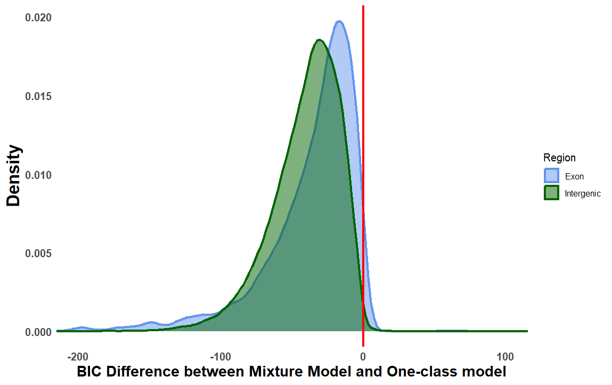
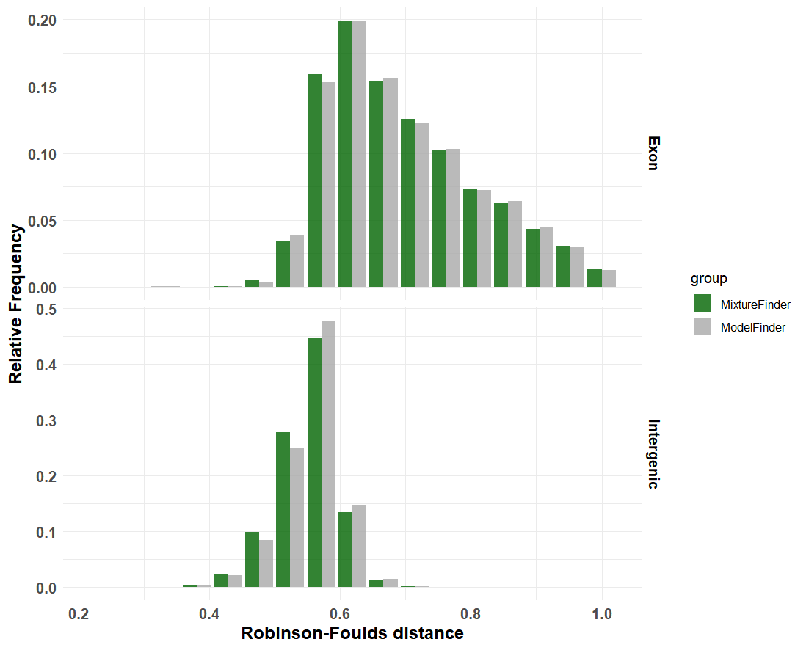
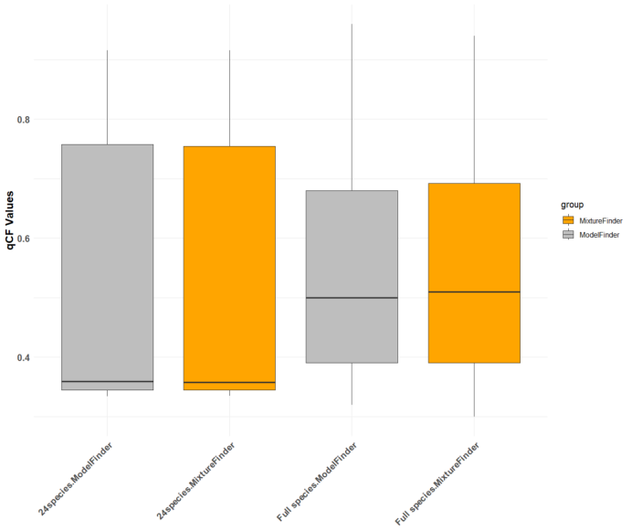

# Final Progress update

- **This progress file contains the results from the latter semester, which were used for the research report**

## 1. Comparison between the one-class model and mixture model
BIC (Bayesian Information Criterion) (Schwarz, 1978) is a criterion for model selection that measures the trade-off between model fit and complexity. In model selection, a lower BIC value indicates a better fit.
The BIC values of the substitution models were extracted from the output files generated when estimating gene trees using IQ-TREE (version 2.3.5.1). 

Specifically, the BIC value for the best model in each locus from both regions and both model types (single model from ModelFinder and mixture model from MixtureFinder) were extracted. We then calculate the difference between the BIC values of the mixture model and the Single Model in each locus (BIC mixture model - BIC single model) and plot the density distribution of the BIC differences.

### **Density distribution of the difference between BIC for the mixture model and the one-class model in the exon and intergenic regions**

The classes number is the number of classes in the best-fit model for each locus. In a single model from ModelFinder, the model number would always be one, while in a mixture model selected by MixtureFinder, the number might be greater than one. Model numbers are also extracted from the output files generated when estimating gene trees using IQ-TREE (version 2.3.5.1), and the model number for each locus in both regions was extracted.

We use the number of models in the best-fit model for each locus and the distribution of BIC differences to compare the one-class model and the mixture model for each locus.

### **Relative frequency of the number of models selected by MixtureFinder in (a) Exon and (b) Intergenic region**

## 2. Evaluation of the gene trees

We use the normalized Robinson-Foulds distance and the tree length of gene trees to evaluate the gene trees produced using the One-class model and the Mixture model.

The Robinson-Foulds distance (Robinson & Foulds, 1981) is a measurement of the similarity between two trees. We calculate the normalized Robinson-Foulds distance (nRF, Robinson-Foulds distance divided by the maximum possible Robinson-Foulds distance for the pair of trees being compared) between each gene tree in a specific gene tree set and the corresponding ASTRAL species tree summarized by that gene tree set using IQ-TREE (version 2.3.5.1). 

In general, a high nRF value indicates a significant difference between two trees, while a low nRF value indicates greater similarity (nRF value of 0 indicates that the two trees are identical). If the mixture model has a substantial impact on improving gene tree estimation, the nRF value should be lower than that using One-class model.

### **Distribution of Normalised Robinson-Foulds (nRF) Distance**

Tree length is simply defined as the sum of all branch lengths in a tree. The branch lengths for each tree in the four gene tree sets (as defined above) were extracted from the output files of IQ-TREE and summed into tree lengths.

### **Tree length of Gene trees estimated by different method in exon and intergenic region**

## Evaluation of the species trees of One-class model and mixture model for both regions

We first use IQ-TREE (version 2.3.5.1) to calculate the normalized RF distances between each of the two species trees of the exon region (one from the single model, and another from the Mixture model) and the two species tree estimated from the intergenic region (one from original study of in Stiller et al. (2024), another from ASTRAL), to directly show the similarity between exon and intergenic species trees.

| nRF distance | Main tree from Stiller et al. | ASTRAL Intergenic species tree (One-class model)|
|-------------|---------|--------|
|ASTRAL Exon treeOne-class model |0.667   | 0.667   |
| ASTRAL Exon treemixture model | 0.667   | 0.667 |

We also use the qCF (quartet concordance factor) and posterior probability (pp) to implicitly evaluate the exon and intergenic species trees. The qCF (quartet concordance factor) is a measurement that counts the proportion of relevant quartets (subtrees of four taxa extracted from gene trees) associated with the reference topologies for the branch of interest in the species tree. Posterior probability is a measure assessing the confidence that the reference topology for the branch of interest is the most frequent among the gene trees (Lanfear & Hahn, 2024). We fix the subsampled main tree the original species tree estimated from the intergenic region in Stiller et al. as the assigned reference tree and calculate the four sets of qCF and pp values using each of the four gene tree sets (as defined above). 

Since the exon species tree is summarized from the geen trees, greater similarity between the species trees of the exon and intergenic region would also be reflected in the gene trees. In oher words, if the mixture model has a substantial impact on making the exon species tree more similar to the intergenic tree, the qCF value using the mixture model should be higher than that using the one-class model. Supplementary Materials 2 show the tabel with full record of qCF and pp results.

### **Tanglegrams of species trees:**

Exon region:
.png)

Intergenic region:

.png)

### **Species tree with qcf/pp value:**

## A small retry using full species

We randomly selected 100 exon loci that contained all species as a trial. The results showed that after using MixtureFinder, the qCF values for the exon region slightly increased. In contrast, the qCF distribution for 4255 exon loci containing only 24 species showed almost no change after using MixtureFinder. This supports our hypothesis that the limited species sampling in our methodology may have contributed to the less significant results.

This plot shows the distribution of qCF values in the tree estimated from 100 exon loci with the full species set (363 species) (two boxes on the right) and the qCF values in the tree estimated from 4255 exon loci with 24 selected species (two boxes on the left). Grey and orange colors represent the results from ModelFinder (One-class model) and MixtureFinder, respectively. From the figure, we can observe that when using 100 loci with the full species set, MixtureFinder increases the overall distribution of qCF values (two boxes on the right). However, when using 4255 loci with 24 species, there is no obvious improvement in qCF (two boxes on the left). qCF values were calculated using ASTRAL-5.7.1.