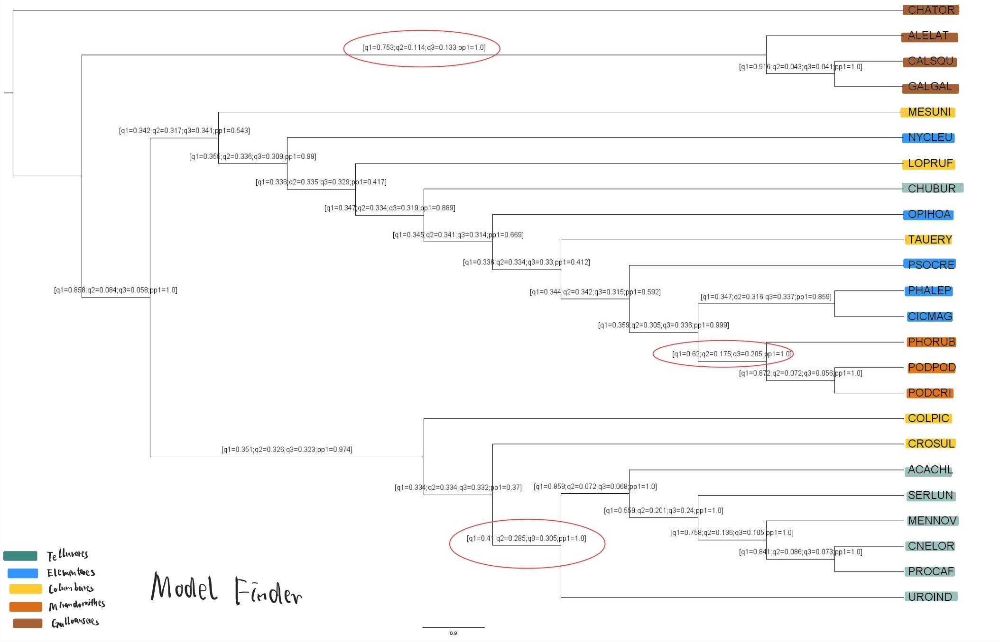
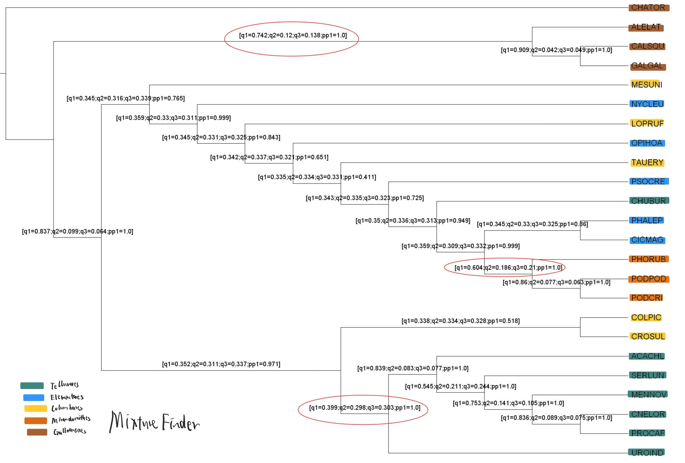
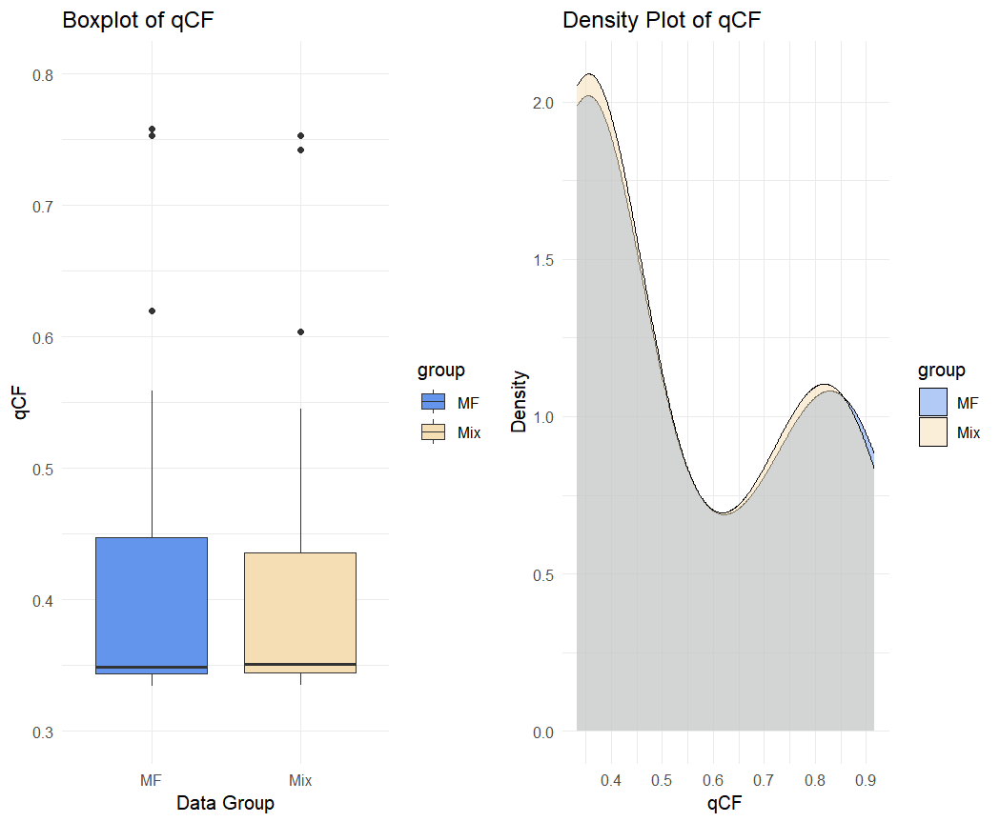

# # Progress record 2: Bird-tree Progress update


## 1. Full datasets

Based on 
- gene coverage (the number of genes that contain that species) (using `select_gene_species.py` in the script folder),
- selecting 2 species from either side of the deepest split for each clade,
- the remaining selected species are closest to the crown node of each clade

**24 species** ( 7 for Telluraves, 5 for Elementaves, 5 for Columbaves, 3 for Mirandornithes, 4 for Galloanseres ) were selected.

After that, **4255 exon loci** containing all of these 24 species were filtered using the `filterespecies_new.py` script in the script folder. Each of the 4255 filtered alignment files now contains only the 24 species instead of 363, and these files are placed in the `4255species_exondata_filtered` folder.

The analysis below was based on these 4255 exon loci. For the **full dataset**, I would change the filter logic to 
- **include any loci that contain 4 or more of these 24 selected species** 

, which would result in **14194 (in 14972)** exon loci.


## 2. Analysis Process (Exon)

Up to now, I have analysised exon loci.

### Model finder

For the ModelFinder, the following command was used (on the server) to calculate gene trees.

```
iqtree2 -S 4255exon -m MFP -pre /data/changsen/4255exon_modelfinder_result/4255mf_combined -T 75
```

This command produces a `4255mf_combined.treefile`, which contains 4255 gene trees.

Then, I used ASTRAL (on my laptop) to generate the species tree:
```
astral -i 4255mf_combined.treefile -o astral_4255species_mf.tree 2> astral_4255species_mf.log
```
It produces a species tree file called `astral_4255species_mf.treefile`.

After that, I calculated the **quartet concordance factor (qCF) and the posterior probability (pp)** using

```
astral -i 4255mf_combined.treefile -q astral_4255species_mf.tree -t 2 -o astral_4255species_mf_qcf.tree  2> astral_4255species_mf_qcf.log
```
It produces a `astral_4255species_mf_qcf.tree` file, in which the qCF (q1,q2,q3) and the posterior probability (pp1) are listed in the annotation (`[]`).

After filtering out other information using a Python script, we finally produce a `4255_mf_qcf_pp_annotated.tree` file.


### MixtureFinder 

First, I ran the `write_multiple_linuxcmd.R` script to write 4255 command into a text file (`iqtree_commands.txt` in the script folder).

A single line of that command is:

```
/data/changsen/bin/iqtree2 -s /data/changsen/4255exon/GALGAL_R00006.fa.nt_ali.filtered.fasta -m MIX+MF -T 1 -mset GTR -pre /data/changsen/4255exon_result/R00006
```

Then, I used the bash script `run_cmd_parallel_new.sh` to run the 4255 command parallelly one the server (maximum CPU was set to 75)

After that, MixTurefinder would produce 4255 gene trees, and R script `combine_genetree.R` was used to combine them into a single tree file.

Then I used ASTRAL (on my laptop) to generate the species tree

```
astral -i 4255combined.treefile -o astral_4255species_mix.tree 2> astral_4255species_mix.log
```
It produces a species tree file called `astral_4255species_mix.treefile`

Then for the qCF and posterior probability (pp)

```
astral -i 4255combined.treefile -q astral_4255species_mix.tree -t 2 -o astral_4255species_mix_qcf.tree  2> astral_4255species_mix_qcf.log
```
It produces a `astral_4255species_mix_qcf.tree` treefile, further cleaned up to `4255_qcfpp_annotated.tree`


### ROBINSON-Foulds distance

The Robinson-Foulds distance between the species trees calculated by MixtureFinder and ModelFinder was calculated by:


```
iqtree2 -rf astral_4255species_mix.tree astral_4255species_mf.tree
``` 

$$
\text{Standardized RF Distance} = \frac{\text{Original RF Distance}}{\text{Maximum RF Distance}}
$$

Where:

- **Original RF Distance** is the value obtained from the `iqtree2 -rf` command.
- **Maximum RF Distance** is calculated as:

$$
\text{Maximum RF Distance} = 2 \times (n - 3)
$$

Here, \( n \) is the number of species in the tree.


The analysis of the Intergenic region will be performed after finishing exon... 


## 3 Exon results and Outline for Result Assessment

The assessment of the results, as well as the example results of the 4255 exon, were shown below:

### 3.1: The species tree with qCF and pp annotated:

The species tree of 4255 loci using ModelFinder, annoated with qCF and pp value：


The species tree of 4255 loci using ModelFinder, annoated with qCF and pp value：



> [!NOTE]
> Problem1: Even when using 4255 exon loci (approximately 30% of overall exon loci), both ModelFinder and MixtureFinder could not correctly recover the main clades.<br> Problem2: **The qCF of MixtureFinder is sometimes lower than the qCF in ModelFinder, which is unexpected.** There may be some issues in the species tree generating or the qCF generating process, but I haven't figured out why.

### 3.2: Table showing the qCF and pp for each Clade in each method 

Since the Elementaves and Columbaves could not be recovered in both plots above, here I **only show the 3 clades that were recovered or basically recovered** (the 3 red circles in the tree above):

| Clade | qCF_MF | qCF_Mix | pp_MF | pp_Mix | 
|-------------|---------|--------|--------------------|-----------------|
| Telluraves | 0.41      | 0.399     | 1.0             | 1.0          |
| Mirandornithes | 0.62      | 0.604     | 1.0             | 1.0          |
| Galloanseres | 0.753  | 0.742    | 1.0            | 1.0        |

From the table above, we see that in **nodes spliting 3 main clades, qCF of MF are always larger than qCF of Mixture Finder** 

### 3.3: Boxplot & density plot to show the distribution of qCF between different method



From the plot above, we can see that in the large qCF value range (qCF > 0.9), the qCFs of ModelFinder are usually larger than those of MixtureFinder. However, in most of the lower qCF value range, the qCFs of MixtureFinder are usually larger than those of ModelFinder


### 3.4: ROBINSON-Foulds distance (species vs species, gene trees vs species)

The ROBINSON-Foulds distance between the 2 species trees of MixtureFinder and ModelFinder is calculated based on the formula above, and the result is 8/42 = **0.1905**.

After finishing the intergenic region analysis, I would also calculate **the RF distance between the exon and intergenic species trees in 2 different method (MF and MixureFinder)**, the RF distance using MixtureFinder is expected be less than that calculated using ModelFinder.

Furthermore, I also calculated the RF distance between the **gene trees and the species tree** produced by those gene trees:

```
iqtree2 -rf astral_4255species_mix.tree 4255combined.treefile
```

```
iqtree2 -rf astral_4255species_mf.tree 4255mf_combined.treefile
```

The result could be visualized for different method (MF and MixureFinder). The RF distance using MixtureFinder is expected be less than that calculated using ModelFinder.


> [!NOTE]
> Problem3: However, my results so far seems strange: all gene trees have the same original RF distance (92) to the species tree in both MixtureFinder and ModelFinder...


## 4 Future Plan

- Solve quesition 1 to 3 above
- Perform the analysis for Intergenic region
- Try to also calculate sCF and gCF, and generate the concordance table and clade plot similar to that one in the concordance paper


