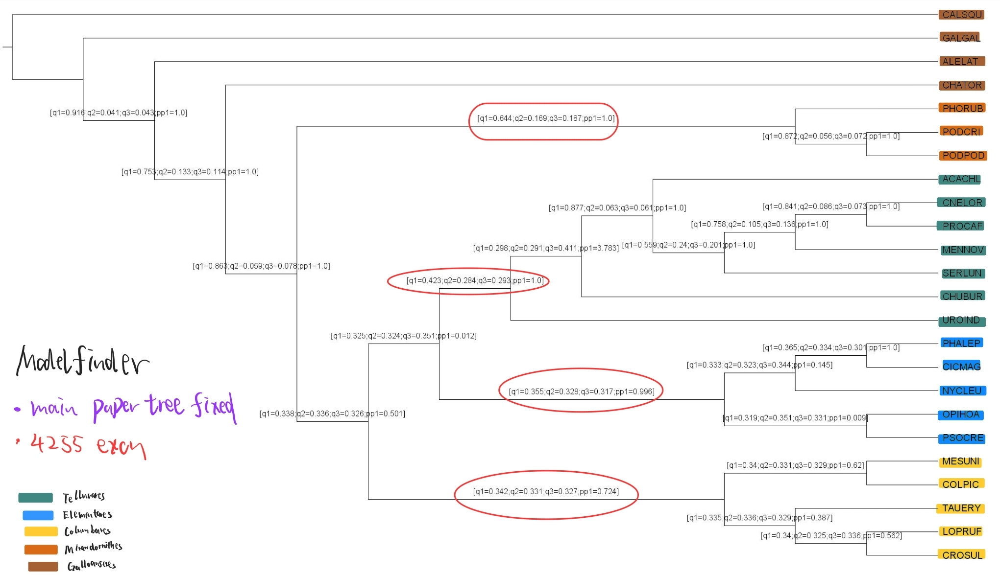
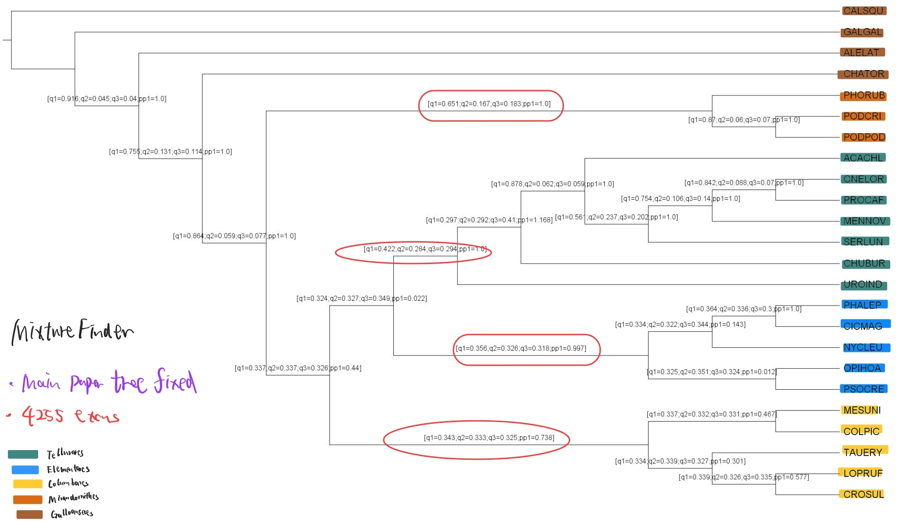
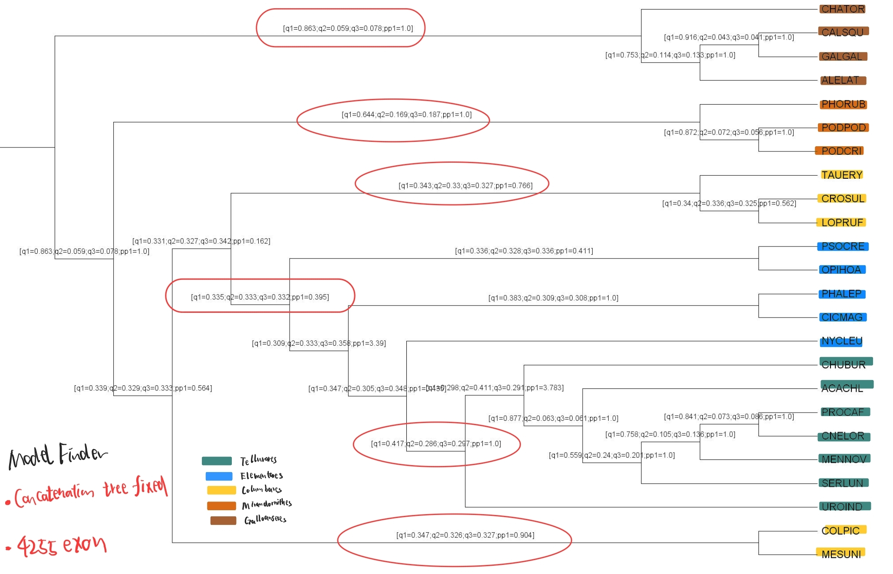
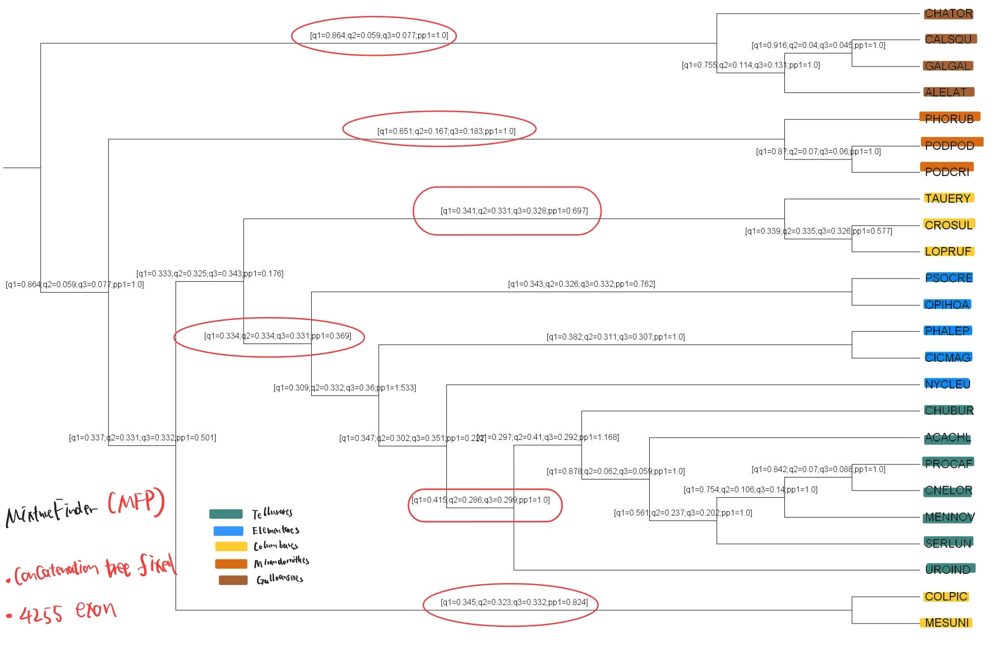
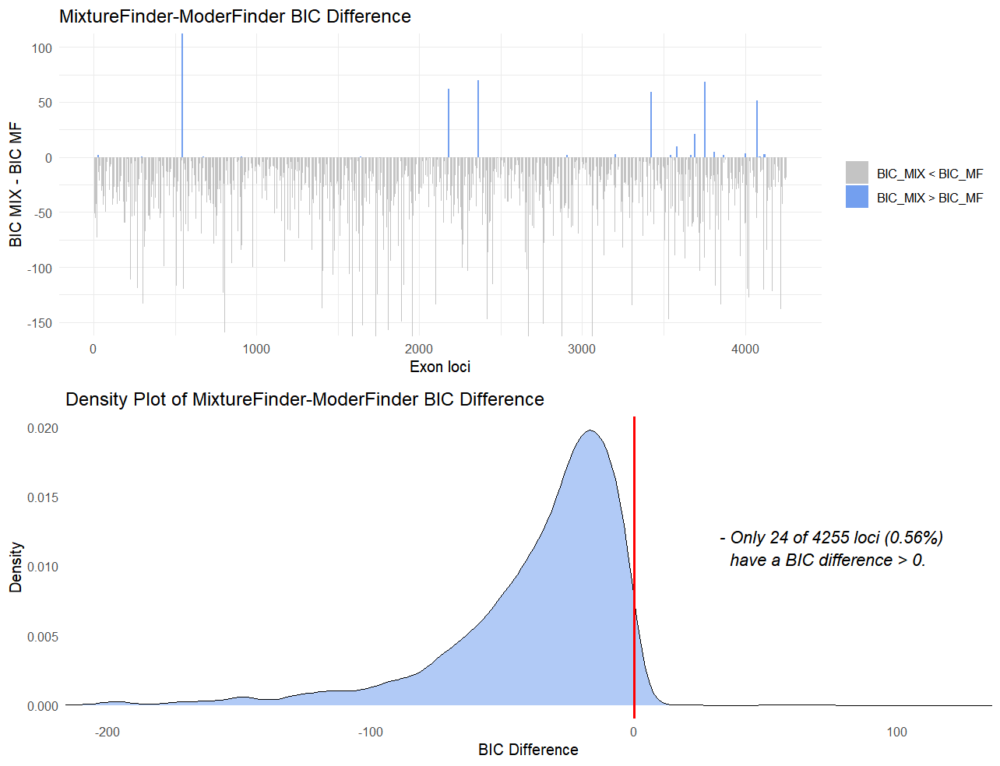
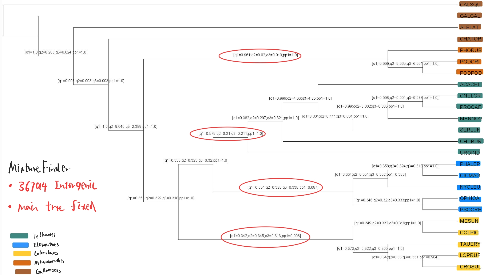
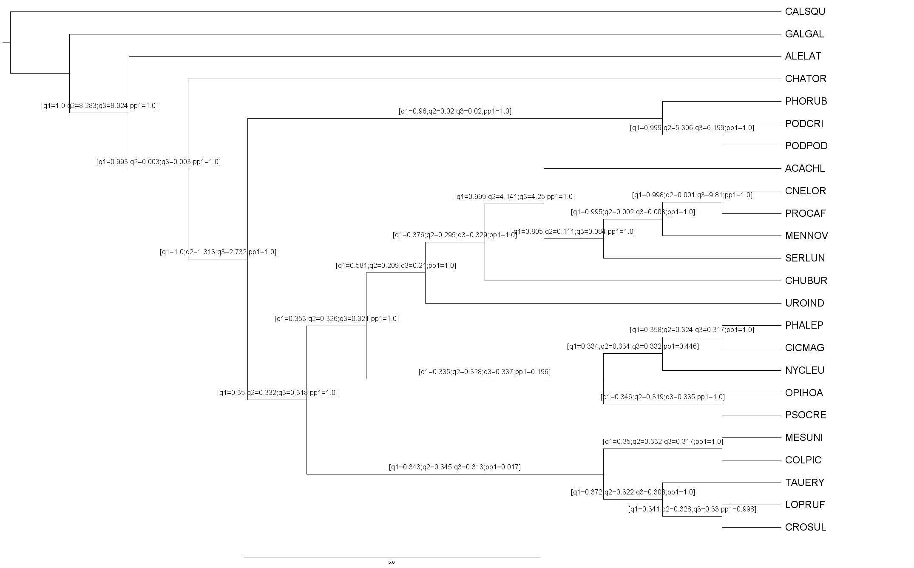

# # Progress record 3: Third Progress update


## 1. Exon

For exon region, several things are done:

- Changed the MixtureFinder command to `-m MIX+MFP` and reran the analysis on 4255 loci.
- After modifying the species filter logic, applied ModelFinder to 14194 exon loci, and calculated qCF and pp values.
- Fixed the species tree in original paper in ASTRAL to get the correct clade grouping (2 kind of paper tree used), then calculate the qCF and pp result for both ModelFinder and Mixture Finder
- Calculate the BIC difference (BIC_MIX - BIC_MF) for 4255 exon loci and visulized it
- Calculated qCF/pp results for the filtered 36794 intergenic region loci using MixtureFinder.


### 1.1 ModelFinder in 14194 loci:

| Clade | qCF_MF_4255 | qCF_MF_14194 |  
|-------------|---------|--------|
| Telluraves | 0.41      | 0.4    |
| Mirandornithes | 0.62      | 0.62     | 
| Galloanseres | 0.753  | 0.85   | 

In the tree and table above, even with 14194 (out of 14972) exon loci, the wrong clade grouping persists. Moreover, the qCF in 2 of 3 recognizable clades does not improve compared to the 4255 loci result.


Therefore, I may continue using the original filter logic (keeping 4255 for exon and 36794 for intergenic) since there is **no great improvement with a larger number of loci.**

### 1.2 Rerun the Mixture Finder and fixed the paper tree to calculate qCF:

As descripted above, `-m MIX+MFP` were used to rerun the analysis, then, 2 kind of orginal paper species trees:

- The main species tree resulting from 63K intergenic regions analyzed with ASTRAL

- The species tree resulting from 63K intergenic regions analyzed with RAxML-NG **concatenation**

Both trees were trimmed to contain only the 24 selected species using `drop.tip`, and the species tree was fixed to ASTRAL to calculate qCF and pp values.

However, the main species tree appears to be loaded incorrectly in R (I tried several methods, including `read.tree()`, but the main species tree could not be loaded properly, with NaN branch lengths).

### 1.2.1 Main species tree fixed:

**ModelFinder:**



**MixtureFinder:**



| Clade | qCF_MF | qCF_Mix | pp_MF | pp_Mix | 
|-------------|---------|--------|--------------------|-----------------|
| Telluraves | 0.423      | 0.422     | 1.0             | 1.0          |
| Elementaves | 0.355      | 0.356     | 0.996            | 0.997         |
| Columbaves | 0.342 | 0.343    | 0.724            | 0.738        |
| Mirandornithes | 0.644  | 0.651    | 1.0            | 1.0        |

From the result fixing main tree, **the Mixture finder tends to have greater qCF and pp value in 3 of 4 clades** (only 4 in total, since the qCF of nodes defining Galloanseres is not shown in figure above)

### 1.2.2 Concatenation species tree fixed:

**ModelFinder:**


**MixtureFinder:**



| Clade | qCF_MF | qCF_Mix | pp_MF | pp_Mix | 
|-------------|---------|--------|--------------------|-----------------|
| Telluraves | 0.417      | 0.415     | 1.0             | 1.0          |
| Elementaves | 0.335      | 0.334    | 0.395            | 0.369         |
| Columbaves | 0.343 & 0.347 | 0.341 & 0.345    | 0.766 & 0.904            | 0.697 & 0.824        |
| Mirandornithes | 0.644  | 0.651    | 1.0            | 1.0        |
| Galloanseres | 0.863  | 0.864    | 1.0            | 1.0        |

The concatenation tree could be loaded **without the problem of NaN branch length**. However, when fixed the concatenation tree, the Columbaves tends to diverge into 2 groups (I think it is because the clade grouping in ther original paper used the main tree rather than the concatenation tree)


### 1.3 BIC difference plot on 4255 Exon loci:

The below figure shows the MixtureFinder-ModelFinder BIC difference along with the 4255 loci, and the density distribution of the MixtureFinder-ModelFinder BIC difference:



From the plot above, **only in few (24 in 4255) loci, MixtureFinder tends to have worse BIC value than ModelFinder**, and in actually 17 of these 24 loci, the amount of the BIC difference is less than 5. The loci that MixtureFinder have obvious worse results (difference greater than 5) are shown below 

| Exon loci | Mixture BIC | MF BIC | BIC Difference |
|-------------|---------|--------|--------------------|
| R02147 |11652.047      | 11322.546    | 329.5012            |
| R09991 | 7059.250      | 6989.755  | 69.4947           |
| R15264 | 3752.677 | 3684.638    | 68.0389            | 
| R09188 |2900.066 | 2837.831   | 62.2349            | 
| R14193 | 6252.653 | 6193.582| 59.0710        | 
| R16467 | 5084.128  | 5032.581    | 51.5466            | 
| R15019 | 7393.064  | 7371.869    | 21.1952           | 


## 2. Intergenic region

Using the same filter logic of the 24 selected species, **I got 36794 (63430 in total) intergenic loci**

Then I run the same process as in exon: ModelFinder vs MixtureFinder

> [!NOTE]
> Problem1: However, ModelFinder failed to run on the server due to a resource error. I checked top, and both thread and memory resources were sufficient. I also reduced the number of threads used, but the following error still persists:

Error in ModelFinder:
```
libgomp: Thread creation failed: Resource temporarily unavailable
```

### MixtureFinder Result of 36794 Intergenic region:




### ModelFinder Result of 36794 Intergenic region:



| Clade |  Intergenic_qCF_Mix | Intergenic_pp_Mix | Intergenic_qCF_Mf | Intergenic_pp_Mf |
|-------------|---------|---------|---------|---------|
| Telluraves | 0.579      | 1.0     | 0.581     | 1.0     | 
| Elementaves | 0.334      | 0.087     | 0.335     | 0.196     | 
| Columbaves | 0.342 | 0.008      | 0.343    | 0.017     | 
| Mirandornithes | 0.961  | 1.0      | 0.96    | 1.0     | 
| Galloanseres | 1.0  | 1.0   | 1.0            | 1.0        |


## 3. Try full species analysis

I have randomly selected 100 exon loci with full species and run with both MixtureFinder and ModelFinder

In ModelFinder, it takes **1h : 31m to run with 75 thread**.

However, in MixtureFinder, using **128 threads**, the analysis of just 100 loci took about **35 hours to finish**, so it is **extremely slow...**


## 4. Several things haven't done:

1: Using `treespace` to visulize the **4255 gene trees around the estimated species tree.** Since my tree results are unrooted, I used the "RF” method rather than the default

> [!NOTE]
> Problem2： I tried the following code to visulise, but too many tree points makes the plot noisy, and when I try to edit the plot, R studio always crashed...(Maybe due to too many trees)

```
species_tree <- read.tree("astral_4255species_mix_mfp.tree")
gene_trees <- read.tree("4255combined_newmix.treefile")
all_exon_trees <- c(species_tree,gene_trees)
treespace <- treespace(all_exon_trees, method = "RF")
plotGroves(treespace$pco, lab.show=TRUE, lab.cex=1.5)
```  

2: The intergenic analysis using ModelFinder (as stated above)

3: Summarize the results of Model 


## 5. Qcf & pp Result Table

| Clade | qCF_MF | qCF_Mix | pp_MF | pp_Mix | 
|-------------|---------|--------|--------------------|-----------------|
| Telluraves | 0.423      | 0.422     | 1.0             | 1.0          |
| Elementaves | 0.355      | 0.356     | 0.996            | 0.997         |
| Columbaves | 0.342 | 0.343    | 0.724            | 0.738        |
| Mirandornithes | 0.644  | 0.651    | 1.0            | 1.0        |

| Locus Region | Method       | Clade           | qCF(q1) | q2   | q3   | pp1  | pp2  | pp3  |
|--------------|--------------|-----------------|---------|------|------|------|------|------|
| **Exon**     | **ModelFinder** | Telluraves      | 0.4231   | 0.2838  | 0.2930| 1.0  |  0    |  0    |
|              |              | Elementaves     |  0.3553  | 0.3276 | 0.3170| 0.9955|  0.0029    | 0.0015     |
|              |              | Columbaves      | 0.3419   | 0.3311| 0.3270|  0.7244|   0.1623    |   0.1133  |
|              |              | Mirandornithes  | 0.6441   | 0.1690 | 0.1869| 1.0  |   0   |   0   |
|              |              | Galloanseres    | 0.8627     | 0.0592  | 0.0781  | 1.0  | 0     |   0   |
|              | **MixtureFinder** | Telluraves   | 0.422   | 0.284  | 0.294| 1.0  |  0.0    |   0.0   |
|              |              | Elementaves     | 0.356   | 0.326| 0.318| 0.997 |  0.002    |    0.001  |
|              |              | Columbaves      | 0.343   | 0.333| 0.325| 0.738| 0.176     | 0.086     |
|              |              | Mirandornithes  | 0.651   | 0.167  | 0.183| 1.0  | 0.0     | 0.0     |
|              |              | Galloanseres    | 0.864     | 0.059  | 0.077  | 1.0  |  0.0    |   0.0   |
| **Intergenic** | **ModelFinder** | Telluraves  | 0.581   | 0.209  | 0.21| 1.0  |  0.0    |  0.0    |
|              |              | Elementaves     | 0.3348   | 0.328| 0.3372| 0.196|    0.036  |  0.768    |
|              |              | Columbaves      | 0.343   | 0.345| 0.313| 0.017|  0.983    | 0.0     |
|              |              | Mirandornithes  | 0.96   | 0.02 |0.02| 1.0  |   0.0   |   0.0   |
|              |              | Galloanseres    | 0.999     | 1.0  | 1.0  | 1.0  |  0.0    |  0.0    |
|              | **MixtureFinder** | Telluraves   | 0.5788   | 0.2103 | 0.2109| 1.0  |  0.0    |  0.0    |
|              |              | Elementaves     | 0.3341   | 0.3278| 0.3382| 0.0868|  0.0205    |  0.8927    |
|              |              | Columbaves      |0.3422   | 0.345| 0.3128| 0.008 | 0.992     | 0.0   |
|              |              | Mirandornithes  | 0.9609   | 0.0197 | 0.0194| 1.0  |   0.0   |  0.0    |
|              |              | Galloanseres    | 1     | 0 | 0 | 1.0  |   0.0   |   0.0   |

