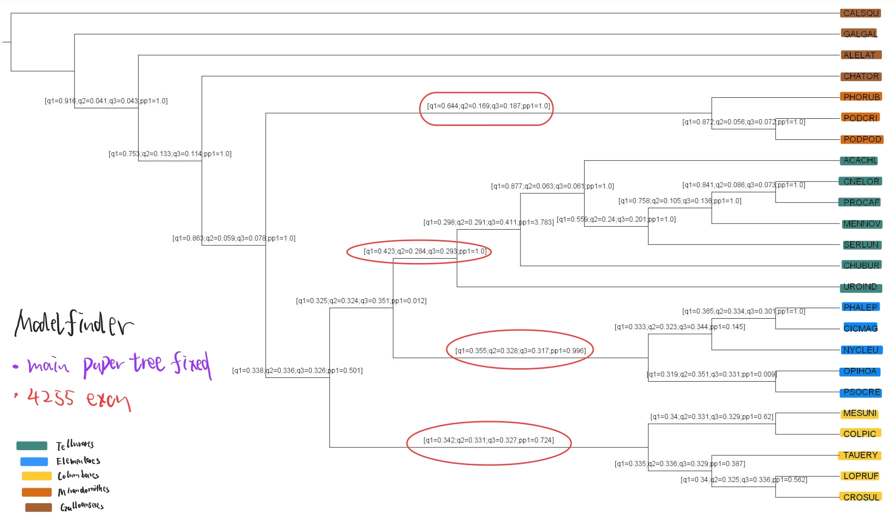
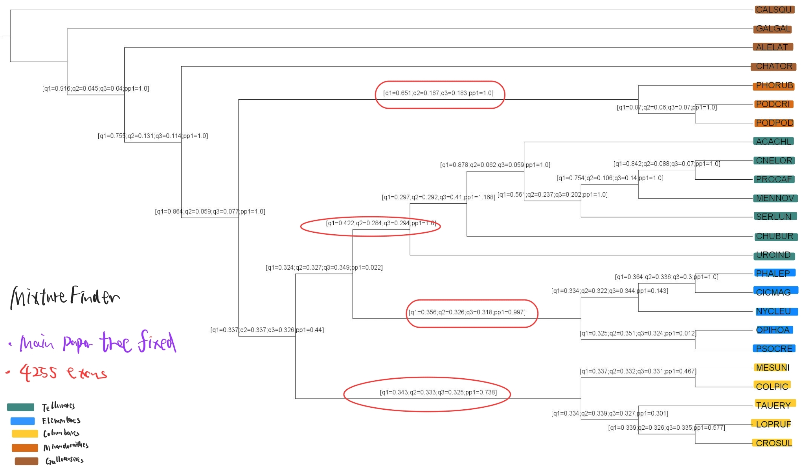
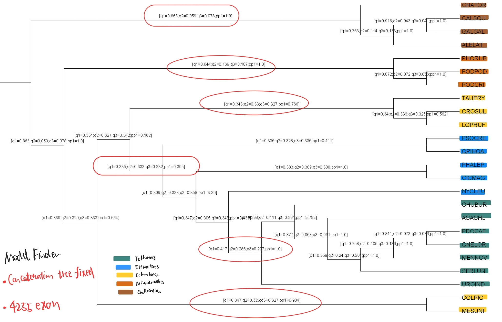
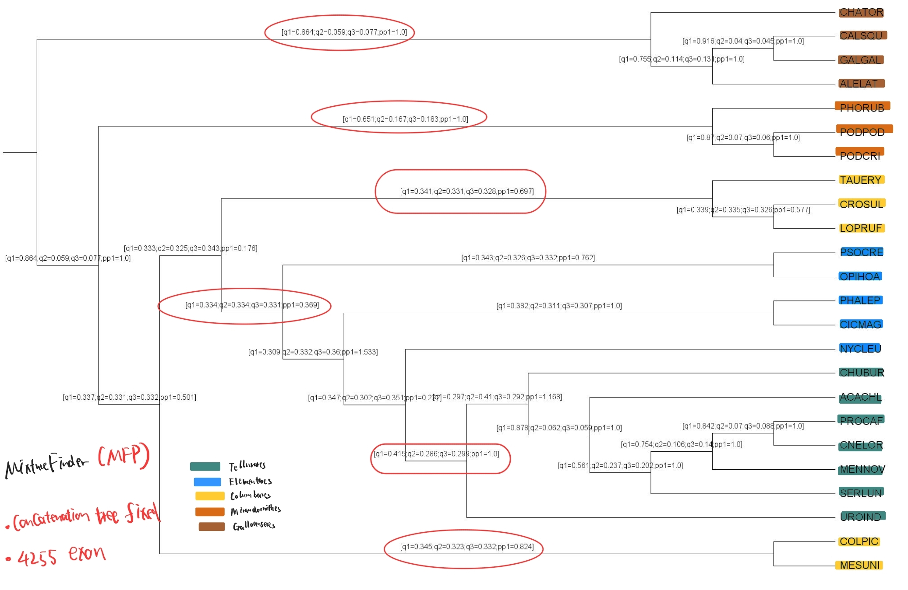
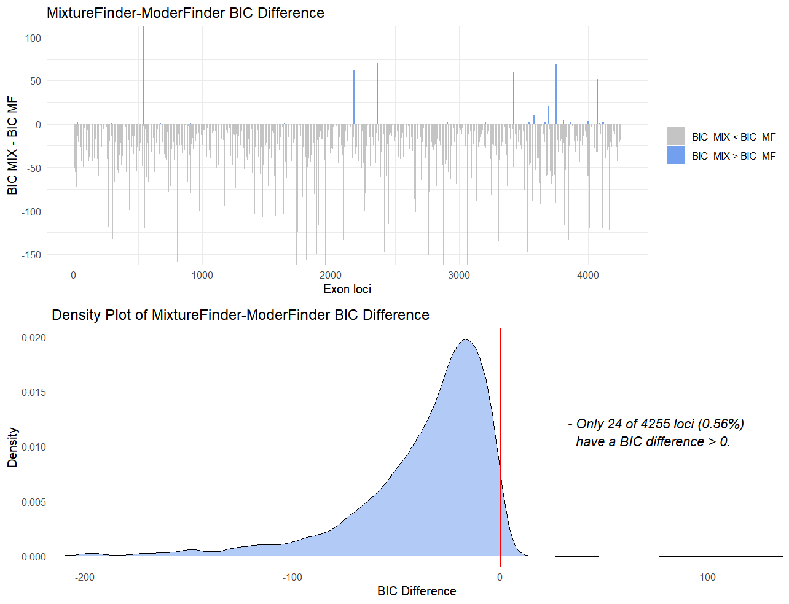
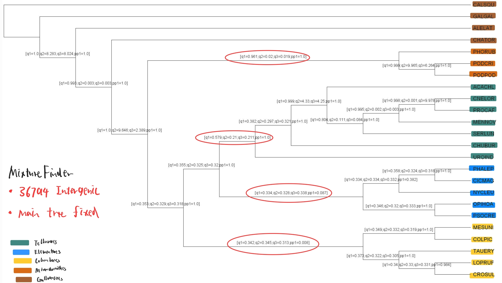

# Week 6 Progress update


## 1. Exon

For exon region, several things are done:

- Change the MixtureFinder cmd to `-m MIX+MFP` and rerun the analysis in 4255 loci
- After changing the species filter logic, use ModelFinder on 14194 exon loci, and calculate qCF and pp
- Fixed the species tree in original paper to get the right clade grouping (2 kind of paper tree used), then calculate the qCF and pp result for both ModelFinder and Mixture Finder
- Calculate the BIC difference (BIC_MIX - BIC_MF) for 4255 exon loci and visulize it


### 1.1 ModelFinder in 14194 loci:

| Clade | qCF_MF_4255 | qCF_MF_14194 |  
|-------------|---------|--------|
| Telluraves | 0.41      | 0.4    |
| Mirandornithes | 0.62      | 0.62     | 
| Galloanseres | 0.753  | 0.85   | 

In the tree and table above, even using 14194 (in 14972) exon loci, we still get the wrong clade grouping, and the qCF in 2 of 3 recognizable clade does not have increase compared to the 4255 loci result.

so maybe I would just use the original filter logic (keep the 4255 for exon and 36794 for intergenic) since **there is no strong improvement after taking much more loci**

### 1.2 Rerun the Mixture Finder and fixed the paper tree to calculate qCF:

As descripted above, `-m MIX+MFP` were used to rerun the analysis, then, 2 kind of orginal paper species trees:
- The main species tree resulting from 63K intergenic regions analyzed with ASTRAL

- The species tree resulting from 63K intergenic regions analyzed with RAxML-NG **concatenation**

were trimmed to only containing the 24 selected species using `drop.tip` , and fixed to ASTRAL to calculate species tree

However, the **main species tree since to be loaded incorrectly in R** (I have tried several methods including `read.tree()`, but the main species tree just could not be correctly loaded, with NaN branch length) 


### 1.2.1 Main species tree fixed:

**ModelFinder:**



**MixtureFinder:**



| Clade | qCF_MF | qCF_Mix | pp_MF | pp_Mix | 
|-------------|---------|--------|--------------------|-----------------|
| Telluraves | 0.423      | 0.422     | 1.0             | 1.0          |
| Elementaves | 0.355      | 0.356     | 0.996            | 0.997         |
| Columbaves | 0.342 | 0.343    | 0.724            | 0.738        |
| Mirandornithes | 0.644  | 0.651    | 1.0            | 1.0        |

From the result fixing main tree, **the Mixture finder tends to have greater qCF and pp value in 3 of 4 clades** (only 4 in total, since the qCF of nodes defining Galloanseres is not shown in figure above)

### 1.2.2 Concatenation species tree fixed:

**ModelFinder:**


**MixtureFinder:**



| Clade | qCF_MF | qCF_Mix | pp_MF | pp_Mix | 
|-------------|---------|--------|--------------------|-----------------|
| Telluraves | 0.417      | 0.415     | 1.0             | 1.0          |
| Elementaves | 0.335      | 0.334    | 0.395            | 0.369         |
| Columbaves | 0.343 & 0.347 | 0.341 & 0.345    | 0.766 & 0.904            | 0.697 & 0.824        |
| Mirandornithes | 0.644  | 0.651    | 1.0            | 1.0        |
| Galloanseres | 0.863  | 0.864    | 1.0            | 1.0        |

The concatenation tree could be loaded **without the problem of NaN branch length**. However, when fixed the concatenation tree, the Columbaves tends to diverge into 2 groups (I think it is because the clade grouping in ther original paper used the main tree rather than the concatenation tree)


### 1.3 BIC difference plot on 4255 Exon loci:

The below figure shows the MixtureFinder-ModelFinder BIC difference along with the 4255 loci, and the density distribution of the MixtureFinder-ModelFinder BIC difference:



From the plot above, **only in few (24 in 4255) loci, MixtureFinder tends to have worse BIC value than ModelFinder**, and in actually 17 of these 24 loci, the amount of the BIC difference is less than 5. The loci that MixtureFinder have obvious worse results (difference greater than 5) are shown below 

| Exon loci | Mixture BIC | MF BIC | BIC Difference |
|-------------|---------|--------|--------------------|
| R02147 |11652.047      | 11322.546    | 329.5012            |
| R09991 | 7059.250      | 6989.755  | 69.4947           |
| R15264 | 3752.677 | 3684.638    | 68.0389            | 
| R09188 |2900.066 | 2837.831   | 62.2349            | 
| R14193 | 6252.653 | 6193.582| 59.0710        | 
| R16467 | 5084.128  | 5032.581    | 51.5466            | 
| R15019 | 7393.064  | 7371.869    | 21.1952           | 


## 2. Intergenic region

Using the same filter logic of the 24 selected species, **I got 36794 (63430 in total) intergenic loci**

Then I run the same process as in exon: ModelFinder vs MixtureFinder

> [!NOTE]
> Problem1 However, the Modelfinder failed when running in server due to the resource error, I have checked top and the thread and memory didn't run out, and I have also tried to decrease the threads used in command, but the below error still exists

Error in ModelFinder:
```
libgomp: Thread creation failed: Resource temporarily unavailable
```

### MixtureFinder Result of 36794 Intergenic region:




| Clade |  Intergenic_qCF_Mix | Intergenic_pp_Mix | 
|-------------|---------|---------|
| Telluraves | 0.579      | 1.0     | 
| Elementaves | 0.334      | 0.087     | 
| Columbaves | 0.342 | 0.008      | 
| Mirandornithes | 0.961  | 1.0      | 


## 3. Try full species analysis

I have randomly selected 100 exon loci with full species and run with both MixtureFinder and ModelFinder

In ModelFinder, it takes **1h : 31m to run with 75 thread**.

But in MixtureFinder using **128 threads**, up to now, only 100 loci analysis have taken more than 6 hours and it haven't finish yet, so it is **superslow**... 


## 4. Several things haven't done:

1: Using `treespace` to visulize the 4255 gene trees around the estimated species tree. 

> [!NOTE]
> Problem2 However, the Modelfinder failed when running in server due to the resource error, I have checked top and the thread and memory didn't run out, and I have also tried to decrease the threads used in command, but the below error still exists

```
species_tree <- read.tree("astral_4255species_mix_mfp.tree")
gene_trees <- read.tree("4255combined_newmix.treefile")
all_exon_trees <- c(species_tree,gene_trees)
treespace <- treespace(all_exon_trees, method = "RF")
plotGroves(treespace$pco, lab.show=TRUE, lab.cex=1.5)
```  

2: The intergenic analysis using ModelFinder (as stated above)

3: Summarise the Model result of ModelFinder and MixtureFinder, and think out a way to visualize it 